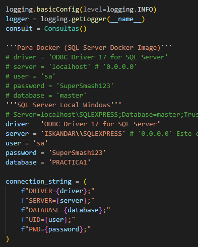
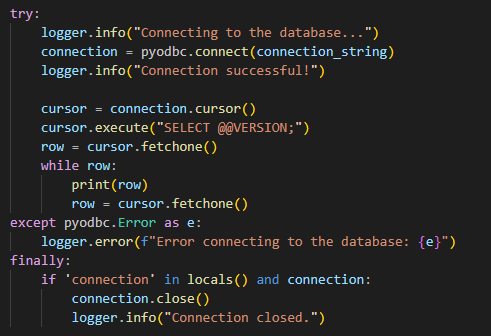
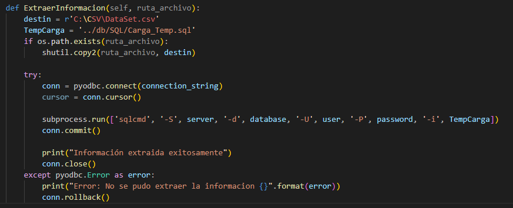
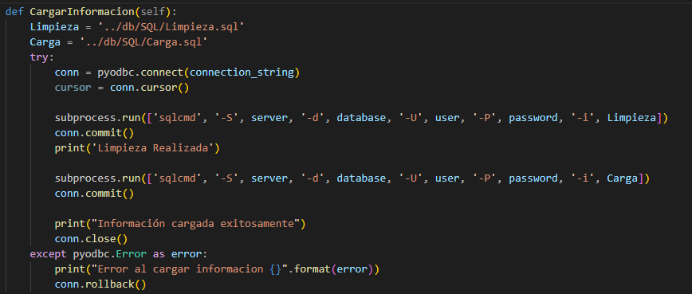
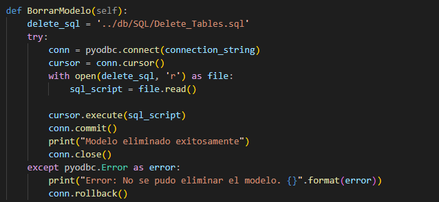
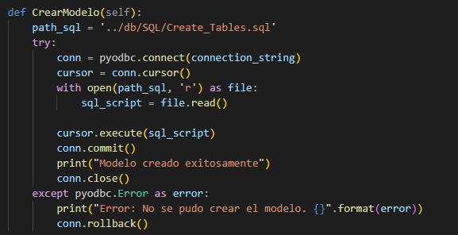
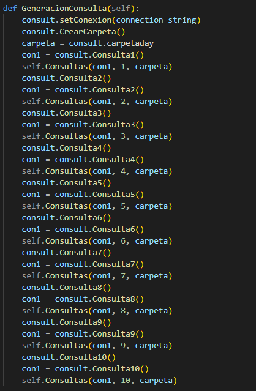
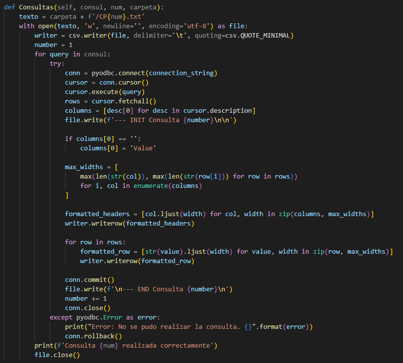
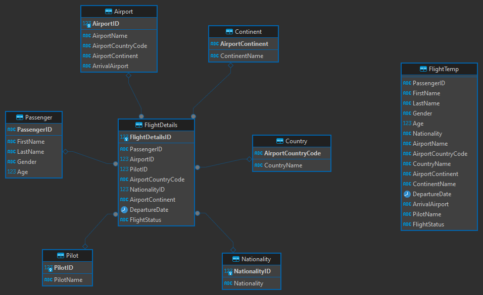

#### Universidad de San Carlos de Guatemala
#### Facultad de Ingenieria
#### Seminario de Sistemas 2"N"
#### Ing: Fernando José Paz Gonzáles
#### Aux: Sergio Enrique Cubur Chalí

## Introducción

Dentro de la primera práctica del laboratorio de Seminario de Sistemas 2, se realizo un programa en el lenguaje de programación python y la base de datos de SQL Server en la cual se creo un sistema de lectura de archivos csv para enviar la información a las tablas que se realizaron y posteriormente se hizo una limpieza y envio de peticiones, commits y modificacion de tablas mediante `pyodbc`.

Se empleo el lenguaje Python como herramenta en la creación de una aplicación que se encarga de leer y parsear la información mediante BULK a una tabla temporal, en la cual se realizarán los procesos de limpieza y clasificación describidos en el enunciado; posteriormente mediante la libreria de `pyodbc` se realizaba la comunicación con la base de datos de SQL Server para escribir la información y para realizar las consultas, posteriormente mediante una función de la aplicación de Python, se forman reportes en formato de texto, los cuales tienen el contenido de las consultas realizadas.

Se pudo determinar que la obtención, lectura/escritura y consultas a la base de datos no mostro ningún problema durante la ejecución del proyecto.

## Requisitos del Sistema

> **Systema Operativo:** Windows, Ubuntu 22.04 o superior
> **CPU:** Intel Pentium D o AMD Athlon 64 (K8) 2.6GHz o superior
> **RAM:** 4GB
> **Lenguajes Utilizados:** Python 3.12.3
> **IDE:** Visual Studio Code
> **Base de Datos:** SQL Server

## Explicación del Código

### Aplicacion Python

Para la aplicación de Python se utiliza pyodbc en la que se configuran las variables para la base de datos de SQL Server.



Una vez hechas las configuraciones para la conexión a la base de datos se hace el establecimiento de la conexión de la base de datos para verificar la conexión a la base de datos.



La aplicación cuenta con las siguientes funciones

> Extración de Información



La función se encarga de pedir una ruta para poder obtener y enviar la información del archivo a la tabla temporal.

> Cargar Información



Con esta función, se hace la limpieza de la información en la tabla temporal y se llenan las tablas principales.

> Borrar Modelo



La función de Borrar modelo se encarga de borrar todas las tablas de la base de datos.

> Crear Modelo



La función de Crear modelo se encarga de la creación de tablas para posteriormente llenarlas.

> Generacion de Consultas



Esta función se encarga de la generación de los reportes haciendo las consultas mediante la siguiente función:



La función se encarga de escribir los archivos de texto en de las consultas realizadas.

### Modelo Utilizado

El modelo utilizado para la creación de la base de datos fue el `Modelo Estrella` por su facilidad para la organización de los datos dentro de las tablas y la formación de peticiones más sencilla.



Se tiene la siguiente Tabla de Hechos:

* **`FlightDetails`:** Esta tabla se encarga de registrar los detalles específicos de cada vuelo, como el pasajero, el aeropuerto, el piloto, la nacionalidad, el continente, la fecha de salida y el estado del vuelo. Contiene claves externas que se refieren a las dimensiones (PassengerID, AirportID, etc.)

Se tienen las siguientes Tablas de Dimensiones:

* **`Passenger`:** Describe los detalles de los pasajeros, como el nombre, género y edad.
* **`Airport`:** Contiene información sobre los aeropuertos, como el nombre del aeropuerto, el código del país, el continente y el aeropuerto de llegada.
* **`Pilot`:** Contiene información sobre los pilotos, como el nombre del piloto.
* **`Nationality`:** Describe la nacionalidad de los pasajeros.
* **`Country`:** Contiene la relación entre el código del país y el nombre del país.
* **`Continent`:** Describe los continentes, relacionando los códigos de continente con los nombres de continente.

### Tablas SQL

Se tienen las siguientes tablas:

> Tabla de Temporal

En esta tabla se cargarán todos los datos mediante la función BULK

```sql
-- Tabla Temporal
CREATE TABLE FlightTemp (
    PassengerID VARCHAR(15) COLLATE Latin1_General_BIN,
    FirstName VARCHAR(75),
    LastName VARCHAR(75),
    Gender VARCHAR(20),
    Age INT,
    Nationality VARCHAR(150),
    AirportName VARCHAR(150) COLLATE Latin1_General_BIN,
    AirportCountryCode VARCHAR(15),
    CountryName VARCHAR(150),
    AirportContinent VARCHAR(20),
    ContinentName VARCHAR(150),
    DepartureDate DATE,
    ArrivalAirport VARCHAR(150),
    PilotName VARCHAR(150),
    FlightStatus VARCHAR(25)
);
```

> Tabla Pasajeros

```sql
-- Pasajeros
CREATE TABLE Passenger (
    PassengerID VARCHAR(15) COLLATE Latin1_General_BIN PRIMARY KEY,
    FirstName VARCHAR(75),
    LastName VARCHAR(75),
    Gender VARCHAR(20),
    Age INT
);
```

> Tabla Aeropuerto

```sql
-- Aeropuerto
CREATE TABLE Airport (
    AirportID INT IDENTITY(1,1) PRIMARY KEY,
    AirportName VARCHAR(150) COLLATE Latin1_General_BIN,
    AirportCountryCode VARCHAR(15),
    AirportContinent VARCHAR(20),
    ArrivalAirport VARCHAR(150),
);
```

> Tabla Piloto

```sql
-- Piloto
CREATE TABLE Pilot (
    PilotID INT IDENTITY(1,1) PRIMARY KEY,
    PilotName VARCHAR(150) UNIQUE
);
```

> Tabla Nacionalidad

```sql
-- Nacionalidad
CREATE TABLE Nationality (
    NationalityID INT IDENTITY(1,1) PRIMARY KEY,
    Nationality VARCHAR(150)
);
```

> Tabla Country

```sql
-- Country
CREATE TABLE Country (
    AirportCountryCode VARCHAR(15) PRIMARY KEY,
    CountryName VARCHAR(150)
);
```

> Tabla Continent

```sql
-- Continente
CREATE TABLE Continent (
    AirportContinent VARCHAR(20) PRIMARY KEY,
    ContinentName VARCHAR(150)
);
```

> Tabla FlightDetails

```sql
-- Detalles de Vuelo
CREATE TABLE FlightDetails (
    FlightDetailsID INT IDENTITY(1,1) PRIMARY KEY,
    PassengerID VARCHAR(15) COLLATE Latin1_General_BIN,
    AirportID INT,
    PilotID INT,
    AirportCountryCode VARCHAR(15),
    NationalityID INT,
    AirportContinent VARCHAR(20),
    DepartureDate DATE,
    FlightStatus VARCHAR(25),
    FOREIGN KEY (PassengerID) REFERENCES Passenger(PassengerID),
    FOREIGN KEY (AirportID) REFERENCES Airport(AirportID),
    FOREIGN KEY (PilotID) REFERENCES Pilot(PilotID),
    FOREIGN KEY (AirportCountryCode) REFERENCES Country(AirportCountryCode),
    FOREIGN KEY (NationalityID) REFERENCES Nationality(NationalityID),
    FOREIGN KEY (AirportContinent) REFERENCES Continent(AirportContinent)
);
```