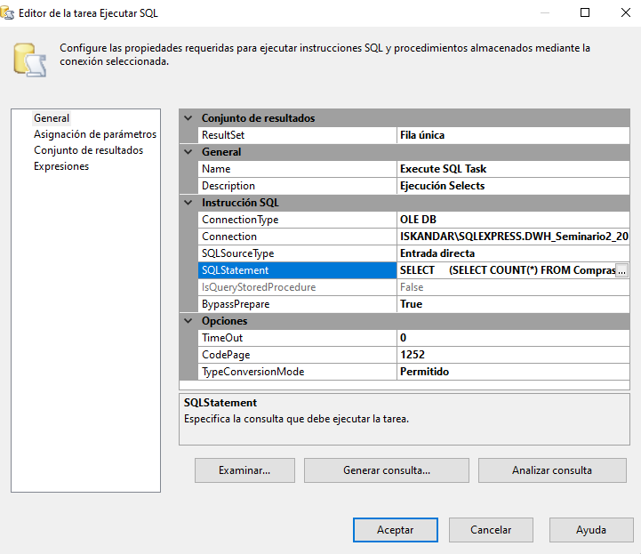
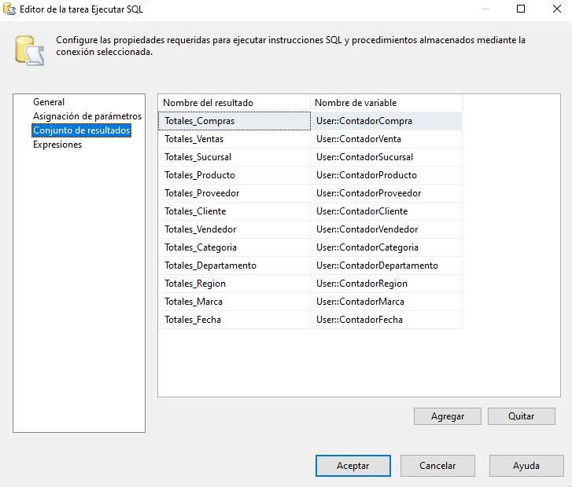

# SG-Food Analytics Warehouse

## Fases Proceso ETL

> Flujo de Control


* Limpieza de Tablas y DWH

Se tendrá las tareas de limpieza de DB1, DB2 y DW en las que borrarán los datos y registros de las tablas en los que se insertará la información posteriormente por la carga de datos y que no hayan datos previos que interfieran con el nuevo proceso ETL.

* Inserción de información en tablas pivote

Se va a realizar la inserción de los datos de los archivos de compras y ventas 1 y 2 en las tablas pivotes correspondientes. Con los datos ya insertados se procedería con el paso del flujo posteriormente.

* Flujo Principal

Este se encargará de la inserción de los datos a las tablas de `Proveedor`, `Marca`, `Categoria`, `Fecha`, `Departamento`, `Vendedor` y `Cliente`, ya que estas no requieren otra tabla que esta indexada, o que requiera de su clave primaria; donde también se estará filtrando la información, y verificando para la posterior inserción en las tablas de la base de datos solución de la DataWarehouse.


* Productos, Region, Sucursal, Compras, Ventas

Estos van a requerir de las tablas que el Flujo se encargo de subir a las primeras tablas, `Productos` va a requerir de lo que es `Categoria` y `Marca` para poder hacer las relaciones entre las tablas; mientras que `Region` requerirá de `Departamentos` en su relación.

Posteriormente se tiene `Sucursal` esta es intermediaria tanto para la inserción de la tabla de `Compras` como la de `Ventas`, requiriendo únicamente de `Region` para hacer sus relaciones.

Una vez se tienen las tablas anteriores el flujo iría a la tabla de `Compras` y `Ventas`, en donde `Compras` utiliza para su relación las tablas de `Proveedores`, `Producto`, `Sucursal` y `Fecha`; y la tabla de `Ventas` utilizaría como referencia para sus relaciones las tablas `Cliente`, `Vendedor`, `Producto`, `Sucursal` y `Fecha`.

Con todo estas últimas dos tareas se ejecuta posteriormente la tarea para el script **_`Execute SQL Task`_** la cuál se detallará más adelante.

* Execute SQL Task

Esta tarea se encargará de ejecutar un script, el cual enviará a las variables la información de la cantidad de datos insertados en cada tabla.



> Script 

```sql
SELECT 
    (SELECT COUNT(*) FROM Compras) AS Totales_Compras,
    (SELECT COUNT(*) FROM Ventas) AS Totales_Ventas,
    (SELECT COUNT(*) FROM Sucursal) AS Totales_Sucursal,
    (SELECT COUNT(*) FROM Producto) AS Totales_Producto,
    (SELECT COUNT(*) FROM Region) AS Totales_Region,
    (SELECT COUNT(*) FROM Departamento) AS Totales_Departamento,
    (SELECT COUNT(*) FROM Marca) AS Totales_Marca,
    (SELECT COUNT(*) FROM Categoria) AS Totales_Categoria,
    (SELECT COUNT(*) FROM Fecha) AS Totales_Fecha,
    (SELECT COUNT(*) FROM Proveedor) AS Totales_Proveedor,
    (SELECT COUNT(*) FROM Cliente) AS Totales_Cliente,
    (SELECT COUNT(*) FROM Vendedor) AS Totales_Vendedor;
```

Los resultados obtenidos en por cada tabla como total se guardarán en las variables creadas.



* Paso Final

Esta tarea solo tendrá el deber de parar (entrar en debug) el seguimiento del proceso del proyecto para poder visualizar la asignación de valores a las variables que se crearon.


## Modelo de DataWarehose Implementado

> Imagen del modelo


Para este modelo se implementó lo que es el **_`Esquema de Constelación`_** ya que como tablas de hechos en este caso se tiene `Compras` y `Ventas` en donde se ramifíca con sus diversas dimensiones donde están las tablas de `Fecha`, `Proveedor`, `Producto`, `Sucursal`, `Cliente` y `Vendedor`. Para lo que es Sucursal, que contará con su dimensión de `Región` y esta misma con una dimensión de `Departamento`.

La utilización del modelo es devido a la necesidad para poder manejar lo que son compras y ventas, los cuales requieren de varias tablas de hechos. Donde la relación entre dimensiones como `Sucursal`, `Región` y `Departamento` Se implementó para tener análisis jerárquicos más detallados. Sin mencionar de las dimensciones que se normalizaron, para poder tener mayor flexibilidad y presición en los reportes que se van a generar. Podiendo manejar volumenes más altos de información en lo que respecta al modelo estrella.