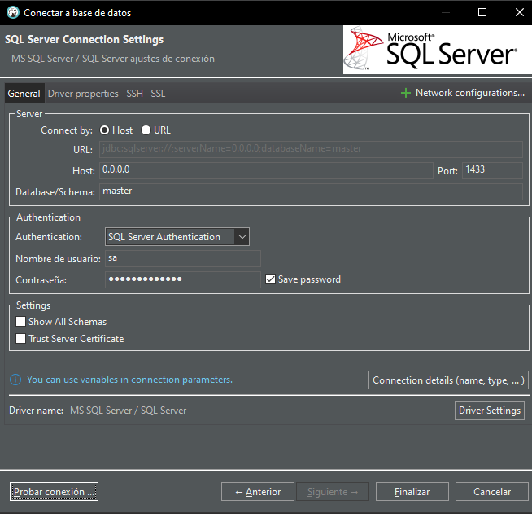

# Connect/Install-db-SQL_SERVER

> Instalar imagen

docker pull mcr.microsoft.com/mssql/server

> Crear contenedor

```bash
 docker run -e 'ACCEPT_EULA=Y' -e 'SA_PASSWORD=SuperSmash123' -p 1433:1433 --name db-prueba -d mcr.microsoft.com/mssql/server
```

> Conectar db

```bash
docker exec -it db-prueba /opt/mssql-tools18/bin/sqlcmd -S localhost -U sa -P SuperSmash123 -C
```

** Tambien se puede

```bash
docker exec -it db-prueba /bin/bash
```

```bash
/opt/mssql-tools18/bin/sqlcmd -S localhost -U sa -P SuperSmash123 -C
```

> Conectar con DBeaver

